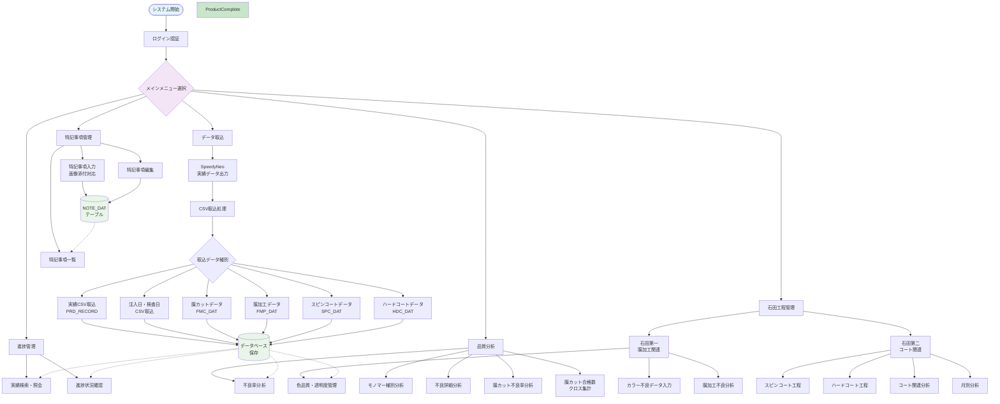

# 生産実績管理システム（JISSEKI）業務フロー図

## システム概要

**作成日:** 2025年6月27日  
**システム名:** 生産実績管理システム（JISSEKI）  
**技術スタック:** Python Flask + MySQL + JavaScript  
**規模:** 55画面 | 23API

## 業務フロー図

## 主要機能説明

### 1. データ取込機能
- SpeedyNeoからのCSVデータ取込
- 6種類のデータ取込に対応
- シフトJISエンコーディング対応
- エラーハンドリング機能

### 2. 進捗管理機能
- 実績データの検索・照会
- **進捗状況確認**: CSVデータに基づく進捗把握
- **現場モニター**: スライド表示（自動更新）
- 未完了案件の優先度管理
- 工程別の遅延管理

### 3. 品質分析機能
- 不良率分析（全体/工程別）
- モノマー種別分析
- 不良詳細分析
- 膜カット関連分析

### 4. 石田工程管理
- 石田第一工程（膜加工関連）
  - カラー不良データ管理
  - 色品質・透明度管理
  - 膜加工不良分析
- 石田第二工程（コート関連）
  - スピンコート工程管理
  - ハードコート工程管理
  - コート関連分析
  - 月別分析

### 5. 特記事項管理
- 特記事項の登録・編集
- 画像添付機能
  - 画質選択（低・中・高）
  - ズーム機能（1.0x～3.0x）
  - 画像サイズ制限（5MB）
- 一覧表示・検索機能

## システムの効果

### 効率化効果
- データ取込の自動化
- 進捗状況の定期更新把握
- 分析作業の効率化
- レポート作成の自動化

### 品質向上効果
- 不良率の可視化
- トレンド分析による予防保全
- 改善活動の体系化
- データに基づく意思決定

### 管理改善効果
- 未完了案件の見える化
- 優先度の明確化
- 情報共有の促進
- 責任の明確化

## 活用方法

1. **新人教育**
   - システム全体像の理解
   - 業務フローの習得
   - 操作方法の習得

2. **工程改善**
   - ボトルネックの発見
   - 改善効果の可視化
   - 改善活動の記録

3. **会議・報告**
   - 現状説明資料
   - 改善提案書
   - 進捗報告書

4. **システム拡張**
   - 影響範囲の確認
   - 機能追加の検討
   - 改善要望の管理 